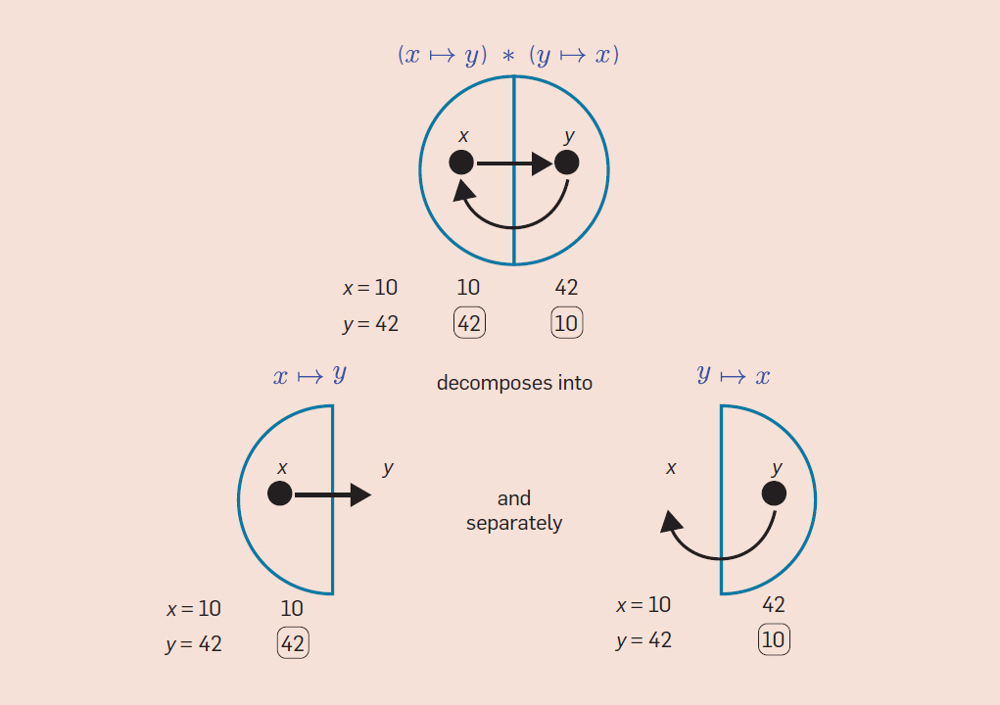

# What is <a href="http://www.cs.cmu.edu/~aldrich/papers/vmcai2018-gradual-verification.pdf" style="color: #364491; border-bottom:1px dotted">Gradual Verification</a>?

【<a href="https://blog.jpramos.me" style="color: #8B0000; text-align: right">main blog</a>】

<br>

## Background

> The following information is in part brought to you by my mentor <a href="https://www.cs.cmu.edu/~jlwise/" style="color: #364491; border-bottom:1px dotted">Jenna Wise</a> during my summer internship at Carnegie Mellon University. 

<br>

### What is verification?
Programmers encounter a lot of bugs during the software development. This is expected, we all know that whatever program we are developing it is most likely to throw an exception. One might naïvely believe that the more seasoned a programmer is, the less errors they'll encounter, no more syntax errors, no more null pointer exceptions! However, a seasoned programmer actually becomes so good at unintentionally developing bugs, that the program won't even tell you when there's an error, the program will seem superficially *sound*, when it in fact is not. The best way to solve this is by writing *unit tests*. Manually developing test cases for a given program, whether you want to take advantage of Testing Driven Development (TDD), or are forced to do so for your undergraduate intro Java course, can become not just annoying, but incredibly non-exhaustive. The subjective *positives* of unit tests, such as TDD, can still be taken advantage of outside of manually writing tests! This can be given through a specification, similar to <a href="https://en.wikipedia.org/wiki/Black-box_testing" style="color: #364491; border-bottom:1px dotted">black box testing</a>. But get this, the specification isn't for the programmer, it's for a *verifier* that will take advantage of the specification, and **check** that your code follows that given specification. Of course, at least ignoring Machine Learning and Program Synthesis research, a computer can't intuitively parse human black box or glass box techniques. Developing these specifications is what's known as a **Formal Method**.

<br>

### Formal verification
Specifications are written in some logic-based language that makes it easier to express properties the developer cares about. An example of this is <a href="https://en.wikipedia.org/wiki/Hoare_logic" style="color: #364491; border-bottom:1px dotted">Hoare logic</a>. Here is a simple example for ensuring that the amount of money in someone's bank account can't become negative when withdrawing from that bank account.

```c
int withdraw ( int amount )
  requires this.balance >= amount // P: PRECONDITION
  ensures this.balance >= 0 // Q: POSTCONDITION
{
  this.balance := this.balance - amount;
}
```
> Annotated method (A-1)

<br>

#### Static verification
This is a verification technique that operates at compile-time. For example, the verifier can ensure that for every call to withdraw that adheres to its precondition withdraw's implementation **will never produce a negative balance**.
- <u>Pros</u>: It provides early and comprehensive feedback to the programmer about errors in an implementation. 
- <u>Cons</u>: Tools require detailed annotations to make such strong guarantees.

```c
a := new Account();
a.balance := 100;
a.balance = 100 // Verifier can figure out `a.balance = 100` here
  P : a.balance >= 30 // The verifier knows this is true due to `a.balance = 100`
a.withdraw(30);
  Q : a.balance >= 0 // Then, the verifier learns only the postcondition
```
> Client Program to Verify

#### Dynamic verification
Unlike static verification, DV operates at run time. 

- <u>Pros</u>: Specifications only need to contain the property a programmer wants to verify. We do not have to be as detailed, because the verifier can leverage run-time information.
- <u>Cons</u>: Specs are only verified for **a single execution**: the pre- and postcondition of withdraw must be verified every time withdraw is called. **This is what we call a runtime check, which requires more computation**.

```c
a := new Account();
a.balance := 100;

assert P: a.balance >= 30 // Check here
a.withdraw(30);
assert Q: a.balance >= 0 // Passes because a.balance = 70 

// The assert will pass, because a.balance = 70 here at run time. In static verification, we could only know the postcondition a.balance >= 0, so this assert would fail a static verifier.
assert a.balance = 70
```
> Client Program to Verify (Dynamic)

<br>

## Advanced Static Verification

> This section quickly details at a more technical level (but still very accessible) the ideas behind static verification. It's not necessary to understand the *Gradualness* I'll talk about later.

<br>

### Preconditions & Postconditions
We use pre- and postconditions to specify the behavior of methods and prove that the behavior we claim of the method is true.

- <u>Postcondition</u>: Something that is true after the method returns and is declared with the `ensures` keyword. The keyword is followed by a formula that can be true or false expressed in the spec language. When the expression is true, we can say that the postcondition holds.
- <u>Precondition</u>: Something that must be true before a method is called. When you call a method, it is your job to establish the precondition, and the static verifier enforces it using a *proof*. When you write a method's body, you get to assume the precondition, but you must establish the postcondition (*the verifier will try to prove the postcondition and you have to make sure it can by giving correct specs and implementation*). The caller of the method then gets to assume that the postcondition holds after the method returns. Not all methods necessarily have preconditions. Preconditions have their own keyword, `requires`.

<br>

### Loop invariants
To make it possible for verifiers to work with loops, you ned to provide loop invariants. A **loop invariant** is an expression that holds upon entering a loop, and after every execution of the loop body (including the last one when the loop condition is false). It captures a property that is invariant, i.e. does not change, about every step of the loop.

<br>

## The Frame Problem 

> For more details on the Frame Problem, read <a href="http://www.cs.cmu.edu/~aldrich/courses/17-355-19sp/resources/recitation09-notes.pdf" style="color: #364491; border-bottom:1px dotted">these lecture notes</a>.

<br>

Consider this program written in <a href="https://en.wikipedia.org/wiki/Dafny" style="color: #364491; border-bottom:1px dotted">Dafny</a>:

```c
class Cell {
  var contents: int;

  method Init()
    ensures contents == 1;
    {
      contents := 1;
    }

    method setContents(x: int)
      ensures contents == x;
    {
      contents := x;
    }
}

method TestCell() {
  var c1 := new Cell;
  var c2 := new Cell;
  c1.Init();
  c2.Init();

  c1.setContents(4);

  assert c1.contents == 4;
  assert c2.contents == 1;
}
```
**This program will not verify correctly in Dafny, because we do not provide specifications that allow us to solve "The Frame Problem".** In particular, `TestCell()` calls `c1.setContents(4)`, the `setContents` method's specification makes no indication of what else may happen to the program state during the execution of `c1.setContents(4)` other than assigning `c1.contents` to `4`. Therefore, the **specification is too weak** to say that `c2.contents` has not changed and is still equal to 1 after the call to `c1.setContents(4)`.

In other words, the problem can be states as follows:
*When formally describing a change in a system, how do we specify what parts of the state of the system are not affected by that change?*

<br>

## A Solution to the Frame Problem

> The possible solutions towards the frame problem are very in-depth and deserve their own blogposts. Therefore, I'll only give a brief explanation of what these solutions provide and a link for your own further reading. Similarly to the previous section, it is not necessary knowledge, but helpful nontheless.

<br>

### <a href="https://cacm.acm.org/magazines/2019/2/234356-separation-logic/fulltext" style="color: #364491; border-bottom:1px dotted">Separation logic</a>
This technique seeks to extend Hoare logic with an operator called the *separating conjunction*, usually noted as either `*` or `&&`.



These *picture semantics* are introduced by Peter O'Hearn to visually describe what's happening with the separating conjunction:

> The indicated separating conjunction here is true of the pictured memory because the parts satisfy the conjuncts, as indicated in the second picture. The meaning of "x points to y and yet to nothing" is precisely disambiguated in the RAM description below the diagram: x and y denote values (10 and 42), x's value is an allocated memory address which contains y's value, but y's value is not allocated. The separating conjunction splits the heap/RAM, but it does not split the association of variables to values.

I should probably also note by now that the idea of a *frame* might be confusing. We are just trying to express an idea of determining a the memory region,
accessed by a computation, to read that memory region for example. Thereafter, it's assured that the access to the rest of allocated memory is independent of this reading. This entire memory *chunk* is a frame.

**We want to prove that an update of a location preserves content of another syntactically different location.**

I'll spare you of unnecessary LaTeX, just know that framing in SL we have two cases, aliasing (pointing to the same memory location) and non-aliasing. For the former case, we want an updated version of the post-condition, whereas in the latter we can just include the same `Q` in the new post-condition. This `Q` refers to a Hoare logic `{P} C {Q}`, in which we, for example want to append a write: `{b -> _} [b] = x {b -> x}`. 

<br>

### <a href="http://viper.ethz.ch/tutorial/#expressions-and-assertions" style="color: #364491; border-bottom:1px dotted">Implicit Dynamic Frames</a>
As stated by <a href="https://dl.acm.org/doi/10.1145/2160910.2160911" style="color: #364491; border-bottom:1px dotted">Smans et al. [2009]</a>, 
an issue with separation logic is that it cannot mention heap-dependent expressions from the host programming language, such as method calls familiar to many developers. Separation logic actually encounters several issues, particularly with recursive heap data structures. IDF is a variant of separation logic that supports heap-dependent expressions inside assertions. Framing in IDF reuses values of a program variable when it doesn't affect a modification of a separate program variable. 

We say that we specify a `dynamic frame f` for `a`: `f frames a`. We also specify the effect of the update to `b`:`b = x modifies g`. If `f` and `g` are disjoint, then we can conclude that `a` and `b` are independent. 

> I am going to end the static verification section here, but it's important I note that I haven't talked about <a href="http://viper.ethz.ch/tutorial/#predicates" style="color: #364491; border-bottom:1px dotted">Predicates</a>, which are a useful tool for specifying unbounded data structures on the heap. 

<br>

## Putting it all together: Almost there!

There are a few things I have to talk about before I get to the beauty of GV, and that is how static verifiers prove programs correct given specifications. 

Without going into too much detail, a static verifier can generate logical formulas to be checked for satisfability, aka SAT. I've already mentioned Hoare logic, but now I want to mention symbolic execution, the reason I mentioned IDFs earlier. 

Symbolic execution is a way of executing a program abstractly, so that one abstract execution covers multiple possible inputs of the program that share a particular execution path through the code. The execution treats these inputs symbolically, *returning* a result that is expressed in terms of symbolic constants that represent those input values.

I also wanted to quickly mention SMT solvers, which symbolic execution relies on. <a href="https://github.com/Z3Prover/z3" style="color: #364491; border-bottom:1px dotted">Z3</a> is a well known SMT solver to check logical formulas for satisfability.


<br>

## Putting it all together: GRADUAL VERIFICATION

Now, finally, what the hell is Gradual Verification!?

Well we've established a couple of verification techniques, static and dynamic, and shown how static verification works. GV seeks to make use of static verification while supporting the incrementality of dynamic verification. 

Essentially, Gradual Verification allows every assertion to either be 
- <u>Complete</u>: Fully defined (static verification)
- <u>Partial</u>: Partially defined (gradual verification)
- <u>Omitted</u>: Completely undefined (dynamic verification)

This is the beauty of gradual verification: *the gradual guarantee*. You've probably heard of gradual typing, which allows parts of a program to be dynamically types and others to be statically typed (i.e. Objective-C, Raku, TypeScript). This gradual guarantee is powerful because it allows the user to define as much of the specification as they want, without losing any precision. **This states that verifiability and reducibility are *monotone* with respect to precision**. If a program `p1` is more precise than a program `p2`, and `p1` is equivalent to `p2` except in terms of contracts, and `p1`'s contracts are more precise than `p2`'s, then the guarantee ensures that `p2` is still a valid program with the reduced precisions of `p1`. 

<br>

### Static gradual guarantee of verification
The dynamic gradual guarantee states that a valid program that takes a step still takes the same step if we reduce the precision of contracts.

### Dynamic gradual guarantee of verification
This means that if a gradual program fails at runtime, then making its contracts more precise will *not* eliminate the error. In fact, doing so may only make the error manifest *earlier* during runtime or manifest *statically*. This is a fundamental property of gradual verification: **a runtime verification error reveals a fundamental mismatch between the gradual program and the underlying verification discipline**. Reducing the precision of specifications does not change the runtimes system's observable behavior for a verified program.

<br>

### Impreciseness and Gradual Verification 
*So what does it mean for a formula to be imprecise exactly?*

Motivated by the following example:
> Note that the example is in C because the gradual verifier I work in is implemented in C, apologies in advance.

> When you read `[]^#` in the code, these aren't part of the actual notation, just a way for me to reference like a footnote.

<br>

```c
void withdrawFee(Account* account)
/*@ requires [acc(account->balance) &&]^1
    account->balance >= 5; @ */
/*@ ensures acc(account->balance) &&
    account->balance >= 0; @*/
[{
  account-> balance -= 5;
}]^2

void monthEnd(Account* account)
/*@ requires [? &&]^3
    acc(account->balance); @*/
/*@ ensures ? &&
    acc(account->balance) &&
    account->balance >= 0; @*/

{
  if (account->balance <= 100)
    [withdrawFee(account);]^4
}
```
As you've probably noticed, there is a `?` whenever we don't want to fully specify a precondition. This is what's called an *imprecise* formula. I won't get into the mathematics of it, but intuitively it tells the verifier that "*Hey, I'm feeling kinda lazy right now, do you mind placing a runtime check here?*". 

There are several things happening to allow this process to work:

1. Side-effects are reasoned about statically using Implicit Dynamic Frames (IDF), where access to memory locations is specified using `acc(object->field)`.

2. Program states are represented by the verifier as formulas in a resource logic. Static information at the end of `withdrawFee`:
```c
acc(account->balance) &&
  account->balance >= 0 &&
  account->balance == old(account-balance) - 5
```

3. `?` allows the verifier to **assume anything necessary to complete proofs**. Assumption in order to satisfy the precondition of `withdrawFee`:
```c
acc(account->balance) &&
  account->balance >= 5
```

4. Wherever specifications are strengthened by the verifier, dynamic checks are inserted into the compiled pforam to ensure proper behavior at runtime:
```c
assert(account->balance >= 5);
```

> This example might have a few technical errors with the precondition and C syntax if you want to be *pedantic*, but overall it provides a good intuition.

<br>

For more technical details on the *gradualness* of specifications, <a href="https://dl.acm.org/doi/10.1145/3428296 " style="color: #364491; border-bottom:1px dotted">checkout this video</a>! 

<br>

### Shameless plug
Pretty neat, huh? Now, what are tools that actively do this? 

Currently CMU has published a couple of papers on Gradual Verification (<a href="http://www.cs.cmu.edu/~aldrich/papers/vmcai2018-gradual-verification.pdf" style="color: #364491; border-bottom:1px dotted">Bader et al. [2018]</a> | <a href="https://dl.acm.org/doi/pdf/10.1145/3428296" style="color: #364491; border-bottom:1px dotted">Wise et al. [2020]</a> | <a href="https://dl.acm.org/doi/10.1145/3484271.3484980" style="color: #364491; border-bottom:1px dotted">Gouni and Zimmerman [2021]</a> ) and work is still in progress to make the technology more accessible. Until then, the ever increasing interest in verification systems —whether they be for the right *moral* reasons— hopefully can help the GV community grow to more applied research and engineering labs. :)

<br>

### Recap
Static verification techniques do not provide good support for incrementality, and dynamic verification approaches support cannot provide static guarantees. 
Gradual Verification bridges this gap, supporting incrementality by allowing the user to specify a given program as much as they want, with a formal guarantee of verifiability.

Gradual Verification is a very new and active area of research which is currently seeking to extend its capabilities for more accessible and global use cases, for example the recent contribution of a gradual verification tool that supports recursive data structures <a href="https://dl.acm.org/doi/pdf/10.1145/3428296" style="color: #364491; border-bottom:1px dotted">Wise et al. [2020]</a>. Watch out for updates to this blogpost or future post for a more in-depth analysis on current GV technology and the sort of stuff I'm working on, such as formal guarantees of program soundness in addition to the already existing verifiability guarantee! 

<br>

<br>

<br>

【<a href="https://blog.jpramos.me" style="color: #8B0000; text-align: right">main blog</a>】
